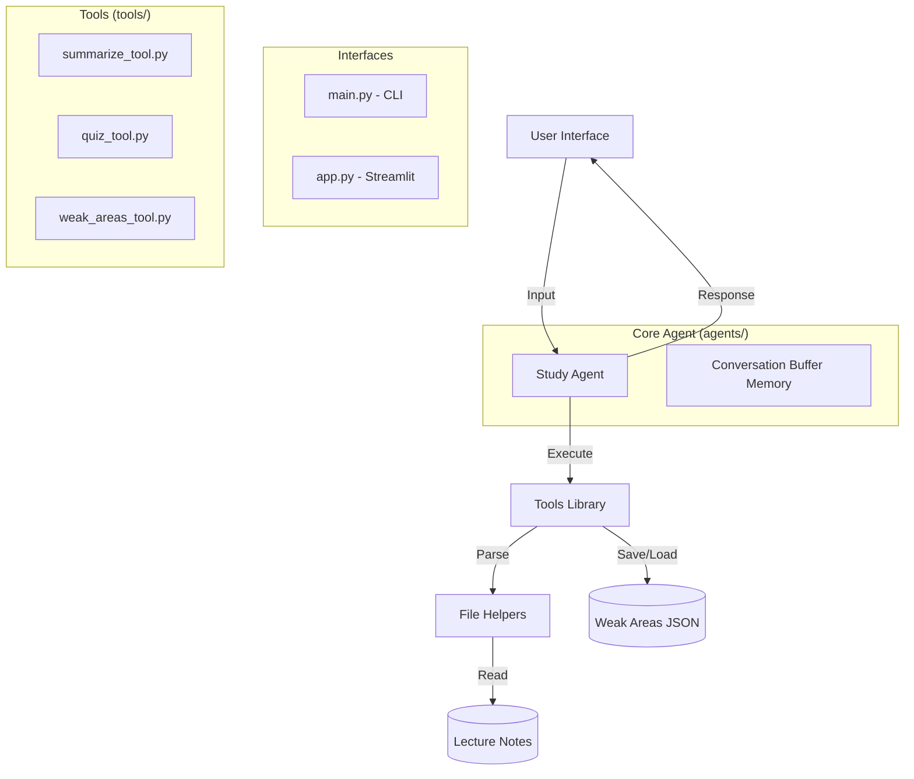
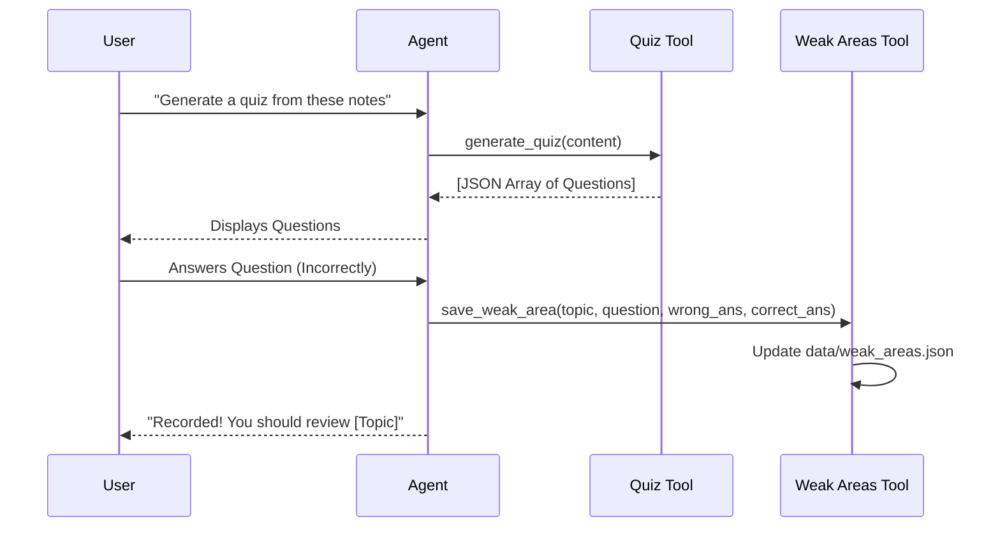

# 🎓 Agentic AI Study Assistant: System Documentation

This document provides a comprehensive technical overview of the **Agentic AI Study Assistant**. It is designed to help developers understand the system architecture, data flow, and how to extend the platform.

---

## 🏗️ System Architecture

The system is built on a modular, agentic architecture. It uses **LangChain** to orchestrate an AI agent that can reason about tasks and call specific tools.



---

## 🧩 Core Components

### 1. The Brain (`agents/study_agent.py`)
The "Brain" is a **LangChain ReAct Agent**. It doesn't just respond to text; it decides which tool to use based on the user's intent.
- **Provider Switching**: Automatically detects if `GOOGLE_API_KEY` (Gemini) or `GROQ_API_KEY` (LLaMA 3) is available.
- **Memory**: Uses `ConversationBufferMemory` to remember context from the summary step into the quiz step.
- **System Prompt**: Instructs the AI on the 5-step study workflow.

### 2. The Tools (`tools/`)
Tools are the "hands" of the agent. They perform specific, isolated tasks:
- **`summarize_tool.py`**: A signal tool that passes text back to the LLM for structured summarization.
- **`quiz_tool.py`**: Forces the LLM to output a raw JSON array of multiple-choice questions. Includes a `parse_quiz_json` helper for robust parsing.
- **`weak_areas_tool.py`**: Manages persistent state. It saves incorrect answers to `data/weak_areas.json` and generates a historical performance report.

### 3. File Helpers (`helpers/file_loader.py`)
A robust document ingestion pipeline that extracts raw text from multiple formats:
- **PDF**: Uses `pypdf` for text extraction.
- **DOCX**: Uses `python-docx` for paragraph parsing.
- **PPTX**: Uses `python-pptx` to scrape all slides.
- **Directory Scanning**: Recursively finds files in folders and groups them by "Course" (folder name).

---

## 🔄 The 5-Step Workflow

The system follows a guided learning path:

1.  **Ingestion**: User uploads documents (PDF/DOCX/etc.).
2.  **Summarization**: Agent distills notes into Key Concepts & Definitions.
3.  **Quiz Generation**: Agent creates 5 custom MCQs based *only* on the provided notes.
4.  **Evaluation**: Student answers; Agent identifies wrong answers.
5.  **Remediation**: Agent saves weak areas and provides targeted study tips.

---

## 📊 Data Flow: Quiz Mode

When a quiz is generated, the data follows this path:



---

## 🛠️ Developer Guide

### How to Add a New Tool
1.  Create a new file in `tools/` (e.g., `flashcard_tool.py`).
2.  Define a function with the `@tool` decorator.
3.  Import and add it to the `tools` list in `agents/study_agent.py`.
4.  Update the `system_prompt` in `study_agent.py` to explain when the agent should use it.

### How to Support a New File Format
1.  Add the extension to `SUPPORTED_EXTENSIONS` in `helpers/file_loader.py`.
2.  Add a new `_load_ext(file_path)` function.
3.  Update the `load_notes` switch-case to include your new loader.

---

## ⚙️ Configuration & Secrets

The system relies on a `.env` file in the root directory:

```env
# For Gemini 1.5 Flash (Recommended)
GOOGLE_API_KEY=AIzaSy...

# For Groq / LLaMA 3.3 70B
GROQ_API_KEY=gsk_...
```

> [!TIP]
> **Pro-Tip for Developers**: When testing locally, use `main.py` with `verbose=True` in the `AgentExecutor` to see the internal "Reasoning Loops" of the agent. This is invaluable for debugging prompt-injection issues or tool-calling errors.

---

## 🚀 Deployment

The system is containerized via `Dockerfile` and ready for **Google Cloud Run**.
- **Base Image**: `python:3.10-slim`
- **Port**: 8080 (standard for Cloud Run)
- **Startup**: `streamlit run app.py --server.port=8080`
